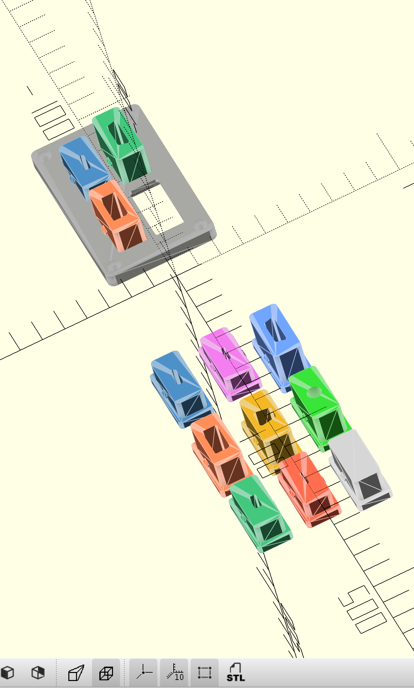

# Modular Cable Organizer

A wall-mountable, modular cable organizer system designed for 3D printing (PLA+).

## Project Structure

```
CableRack/
├── parameters.scad           # Central configuration (dimensions, tolerances)
├── insert_base.scad          # Base insert module with snap tabs
├── frame_single.scad         # Single-slot test frame
├── print_frame_2x2.scad      # 2x2 frame (4 slots) - PRODUCTION
├── print_frame_3x3.scad      # 3x3 frame (9 slots) - PRODUCTION
├── print_frame_wall_test.scad          # Wall thickness validation
├── print_frame_validation_test.scad    # Comprehensive test suite
├── insert_*.scad             # All connector insert types
├── print_insert_*.scad       # Print files for each insert
├── demo.scad                 # Demo view with all inserts
├── print/                    # Pre-generated STL files
├── ReferenceImages/          # Design reference blueprints
├── UPDATES.md                # Recent changes and improvements
└── README.md                 # This file
```

## Development Status

### ✅ Phase 1-4: COMPLETED
- [x] Parameters system with tolerances
- [x] Snap-fit mechanism with tabs
- [x] Single-slot test frame
- [x] Multi-slot parametric grid frames (2x2, 3x3)
- [x] Wall mounting holes with countersinks
- [x] Complete insert library (9 connector types)
- [x] Production-ready print files

### 🎯 Current Features
- **Frames**: Single (1x1), 2x2 (4 slots), 3x3 (9 slots)
- **Strong walls**: 2.4mm between slots (6 layers @ 0.4mm nozzle)
- **Inserts**: USB-C, USB-A, USB-Mini, USB-Micro, USB-B, Lightning, HDMI, 3.5mm jack, Blank/Label
- **Wall mounting**: 4-corner screw holes with countersinks
- **Snap-fit retention**: Tool-free insert installation/removal

## Print Settings (Recommended)

| Setting | Value |
|---------|-------|
| Material | PLA+ |
| Layer Height | 0.2mm |
| Nozzle | 0.4mm |
| Infill | 20-30% |
| Walls | 3 perimeters |
| Supports | None needed |

## Production Printing

### Ready-to-Print Files

Pre-generated STL files are in the `print/` directory:

**Frames:**
- `print_frame_single.stl` - 1x1 single slot (test frame)
- `print_frame_2x2.stl` - 2x2 grid (4 slots) - **Most common**
- `print_frame_3x3.stl` - 3x3 grid (9 slots) - NEW

**Inserts:** (9 types)
- `print_insert_usbc.stl` - USB Type-C
- `print_insert_usba.stl` - USB Type-A
- `print_insert_usb_mini.stl` - USB Mini
- `print_insert_micro.stl` - USB Micro
- `print_insert_usb_b.stl` - USB Type-B
- `print_insert_lightning.stl` - Apple Lightning
- `print_insert_hdmi.stl` - HDMI
- `print_insert_audio_jack.stl` - 3.5mm audio jack
- `print_insert_blank.stl` - Blank/label insert

### Test & Validation Files

Before printing production parts, validate with test files:

**Wall Thickness Test** (`print_frame_wall_test.scad`)
- Small print showing 2.4mm wall between slots
- Validates structural strength
- Quick print (~10 min)

**Comprehensive Validation** (`print_frame_validation_test.scad`)
- Wall cross-section view
- Insert fit test with clearances
- Frame size comparison (1x1, 2x2, 3x3)
- Uncomment desired test in file

### Generating STL Files

If you modify the design, regenerate STL files:

```bash
# Using OpenSCAD GUI: File > Export > STL
# Or from terminal:
cd /path/to/CableRack
openscad -o print/print_frame_2x2.stl print_frame_2x2.scad
openscad -o print/print_frame_3x3.stl print_frame_3x3.scad
# etc...
```

### Print Orientation

**Frames**: Print with back (flat) side down
- No supports needed
- Mounting hole countersinks on bottom
- Optimal layer adhesion for strength

**Inserts**: Print with port opening down
- Base plate prints first for dimensional accuracy
- Snap tabs print cleanly
- No supports needed

## Key Dimensions

| Parameter | Value | Description |
|-----------|-------|-------------|
| Slot size | 32mm × 16mm | Interior frame slot (2:1 aspect) |
| Insert base | 31.4mm × 15.4mm | With 0.3mm clearance |
| **Frame wall** | **2.4mm** | **Between slots (6 layers @ 0.4mm nozzle)** |
| Frame depth | 6mm | Z height (2mm back + 4mm slot) |
| Insert body | 12-16mm | Varies by connector type |
| Clearance | 0.3mm | Standard FDM tolerance |
| Border | 8mm | Frame border with mounting holes |

## Viewing in OpenSCAD

**Demo Visualization** (`demo.scad`)
- Shows 2x2 frame with 4 different inserts
- Displays all 9 insert types in a 3x3 grid
- Toggle `show_cutaway = true` for cross-section view
- Color-coded inserts for easy identification

**Test Files**
- `print_frame_wall_test.scad` - Wall thickness validation
- `print_frame_validation_test.scad` - Multiple test views

## Recent Updates

See `UPDATES.md` for recent changes, including:
- Frame wall thickness increased to 2.4mm (6 layers @ 0.4mm nozzle)
- New 3x3 frame option
- Comprehensive test files for validation
- Improved parametric frame system

## License

Personal/educational use.

## Preview

<p align="center">
  
</p>

